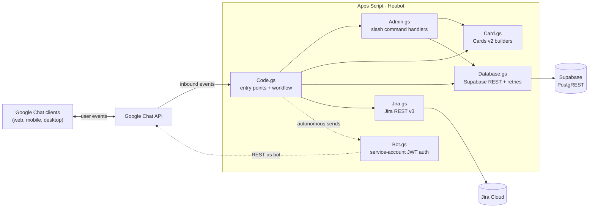

# Heubot — Google Chat Standup Bot

Async daily standup bot for the Heubert Nepal team. Members fill a 3-question standup from their Chat DM each afternoon; a consolidated digest posts to the team space the next morning.

Modeled on DailyBot/Geekbot, built on Apps Script + Supabase.

**Status:** Live in production since April 14, 2026.

---

## Table of Contents

1. [For admins — what you need to know](#for-admins--what-you-need-to-know)
2. [Onboarding new team members](#onboarding-new-team-members)
3. [Common admin tasks](#common-admin-tasks)
4. [When things go wrong](#when-things-go-wrong)
5. [Current production state](#current-production-state)
6. [Architecture](#architecture)
7. [For developers — setup from scratch](#for-developers--setup-from-scratch)
8. [Database schema](#database-schema)
9. [File-by-file overview](#file-by-file-overview)
10. [Maintenance & credential rotation](#maintenance--credential-rotation)
11. [Troubleshooting (dev-level)](#troubleshooting-dev-level)
12. [Known limitations](#known-limitations)

---

## For admins — what you need to know

**Admins currently:** `jenish@heubert.com`, `sameer@heubert.com`, `nikhil@heubert.com`

Admins can run privileged slash commands that affect everyone's standup flow. Non-admins can only use `/standup` (to fill their own standup).

### The daily cycle (automatic)

| Time (Asia/Kathmandu) | What happens | Function |
|---|---|---|
| **16:45** | Bot DMs every active member a notification card | `sendStandupNotifications` |
| **17:15** | Bot DMs anyone who hasn't submitted yet | `sendReminders` |
| **09:00 next workday** | Bot posts consolidated digest to the **Heubot Standups** team space | `postDigest` |
| 1st of month, ~10:00 | Bot checks DB usage and warns admins if near quota | `checkDbUsage` |

Weekends are skipped automatically. Friday notifications are for Monday's meeting.

### Slash commands — admin-only

All of these are DM-only (run them in your 1-on-1 DM with Heubot):

| Command | What it does |
|---|---|
| `/settings` | Shows current bot configuration (schedule, team size, questions, digest space) |
| `/set-schedule` | Opens a form to change prompt / reminder / digest times |
| `/questions` | List current standup questions with Remove buttons |
| `/add-question` | Add a new question to the standup form |
| `/team` | List active and inactive team members with Remove / Activate buttons |
| `/add-member` | Add a new team member |
| `/notify-all` | Manually trigger the daily prompt (if the 16:45 cron didn't fire or you want to re-send) |
| `/digest-now [YYYY-MM-DD]` | Manually post the daily digest (defaults to today's meeting) |
| `/status` | Shows who's submitted and who's still pending for the upcoming standup |
| `/purge` | Delete standup responses by date range (for data retention) |
| `/set-this-space` | Run inside a team space to register it as the digest destination |

### Slash commands — everyone (admins and members)

| Command | What it does |
|---|---|
| `/standup` | Opens a conversational standup session for the active meeting date |
| `/standup YYYY-MM-DD` | Opens the form for a specific future meeting date (useful for pre-filling) |

---

## Onboarding new team members

When someone joins the team and needs to start receiving standup prompts, do these 3 things in order:

### 1. Add them to the `team_members` database

Run `/add-member` in your DM with Heubot. Fill in:

- **Name** — as you want it to appear in the digest
- **Email** — their Heubert Google Workspace email
- **Jira Username** — leave blank (optional; email is used for ticket lookup as a fallback)

Alternatively, run this SQL in Supabase directly:

```sql
INSERT INTO team_members (name, email, jira_username, active)
VALUES ('Full Name', 'email@heubert.com', '', true);
```

### 2. Send them the onboarding message

Paste this in a DM or email to the new member:

> Hey [name] — I've added you to Heubot, our daily standup bot.
>
> **One-time setup (~30 seconds):**
> 1. Open Google Chat → **Apps** in the sidebar → search **Heubot** → click **Install**
> 2. Accept the permissions it asks for
> 3. Run **`/standup`** once in the DM that opens
>
> That's it. From tomorrow you'll get a prompt at 4:45 PM each workday to fill in your standup. The next morning, everyone's updates get posted to the **Heubot Standups** space for our morning sync.
>
> Ping me if you hit any issues.

### 3. Verify they're set up

Once they've run `/standup` once, check in Supabase:

```sql
SELECT name, email, chat_user_id, active
FROM team_members
WHERE email = 'their.email@heubert.com';
```

If `chat_user_id` is populated (starts with `users/` followed by numbers), they're fully onboarded. They'll receive their first notification at 16:45 the next workday.

**If `chat_user_id` is `NULL`**, they haven't interacted with the bot yet. They need to run `/standup` (or any slash command) once.

### Important — why the one-time interaction is required

Google Chat API requires a numeric user ID (like `users/117260094786438825675`) to send autonomous DMs. Apps Script can't look up that ID from an email — the bot has to capture it from an event the user triggers. So every new member must run at least one slash command before the bot can DM them automatically.

---

## Common admin tasks

### Remove someone who left the company

**Soft delete (preserves their historical standup data):**

```sql
UPDATE team_members SET active = false WHERE email = 'leaver@heubert.com';
```

Or run `/team` and click the **Remove** button next to their name. They stop receiving prompts but their past responses stay in digests.

**Hard delete (GDPR / "forget this person"):**

```sql
DELETE FROM standup_responses WHERE email = 'leaver@heubert.com';
DELETE FROM team_members WHERE email = 'leaver@heubert.com';
```

### Promote someone to admin

```sql
INSERT INTO admins (email) VALUES ('new.admin@heubert.com');
```

They can immediately run admin slash commands. No other setup needed.

### Change the daily schedule

Run `/set-schedule` in your DM. Enter new times in 24-hour format (HH:MM). Click Save.

The bot also rebuilds the time-based triggers on save, so the new schedule takes effect starting the next day.

**Note:** Apps Script time triggers fire in a 1-hour window, not at the exact minute. "16:45" means "somewhere between 16:00 and 17:00."

### Change the standup questions

- `/questions` — shows current questions with Remove buttons
- `/add-question` — opens a form to add a new one

Changes apply to the next standup cycle. Members who already submitted for the current meeting keep their previous answers.

### Change the digest space

If you create a new team space and want digests to post there instead:

1. Add Heubot to the new space (`@Heubot` → Add to space)
2. Run `/set-this-space` from inside the new space
3. Verify with `/settings` — should show the new space ID

### Manually trigger the daily prompt (if cron failed)

Run `/notify-all` in your DM. The bot sends notification cards to every active member. Skip the weekend check — runs regardless of day.

### Manually post the digest (if cron failed)

Run `/digest-now` in your DM. Posts the digest for **today's meeting**. For a specific date:

```
/digest-now 2026-04-15
```

### Check who's submitted

Run `/status` in your DM. Shows the active meeting date, count of responders and pending members, and names in each bucket.

### Delete old standup data

Run `/purge` in your DM. Enter a start and end date. Deletes all responses in that range across all members. Can't be undone — double-check the dates before clicking Delete.

---

## When things go wrong

### "Bot isn't DMing [person]"

Their `chat_user_id` hasn't been captured. Have them run `/standup` once. If they can't find Heubot in Chat, re-send them the onboarding instructions (above).

### "No digest posted this morning"

The cron may have failed. Run `/digest-now` manually. Then check **Apps Script → Executions** for the 09:00 entry:

- If no entry exists, the trigger may have been disabled. Contact the developer to re-install triggers.
- If the entry failed, the error message will tell you what's wrong.

### "`/set-schedule` gave a trigger rebuild warning"

Normal — Google's trigger-creation quota resets on a rolling 24-hour window. The settings save succeeded; only the trigger rebuild failed. The old trigger times stay in effect. Contact the developer to run `createTriggers` manually from the Apps Script editor when the quota resets.

### "Standup Space is `spaces/REPLACE_ME`"

The digest space was never registered. Go to the Heubot Standups space and run `/set-this-space`.

### "Jira tickets aren't showing up in the digest"

Likely the Jira API token expired. Admins receive a DM notification when this happens. Contact the developer to update the `JIRA_API_TOKEN` in Apps Script Script Properties.

### "Bot says 'Access Denied' when I run an admin command"

Your email isn't in the `admins` table. Ask an existing admin to add you (SQL above), or verify you're signed in as your heubert.com account (not a personal Google account).

### "Empty/useless digest Monday morning after a Friday holiday"

Known edge case. The digest fires on Monday showing "0 of 14 responded" because nobody filled Friday. Just ignore it and proceed with the day. Future versions may suppress empty digests.

---

## Current production state

As of April 14, 2026:

| | Value |
|---|---|
| **GCP project** | `heubot` |
| **Apps Script script ID** | `14qUQXBvMSYxoNeqg1ixfk0hepIFm1ljzhSiLoDDLzrt2d1gebkq3qllM` |
| **Service account** | `heubot-bot@heubot.iam.gserviceaccount.com` |
| **Active deployment type** | Add-on (Workspace Add-on model) |
| **Marketplace status** | Published privately to Heubert Workspace |
| **Timezone** | Asia/Kathmandu |
| **Schedule** | Prompt 16:45 · Reminder 17:15 · Digest 09:00 next workday |
| **Digest space** | `spaces/AAQAYxN4n3A` (Heubot Standups) |
| **Team size** | 14 active members |
| **Admins** | jenish@heubert.com, sameer@heubert.com, nikhil@heubert.com |
| **Backing store** | Supabase (Asia/Kathmandu region) |
| **Jira** | Heubert Atlassian, Basic Auth with API token |

---

## Architecture



**Two distinct paths into the Chat API:**

- **Solid lines** — request/response for inbound user events. Handler returns a card; framework posts it as the bot.
- **Dotted lines** — autonomous outbound sends (cron prompts, reminders, digests). `Bot.gs` mints OAuth tokens from a GCP service account and calls `chat.googleapis.com` directly. Without this, cron jobs would fail with `"Message cannot have cards for requests carrying human credentials"`.

---

## For developers — setup from scratch

This section is for recreating Heubot from nothing in a new Workspace or migrating to a new Google account.

### Prerequisites

- A **Google Workspace** account (admin access to enable the Chat API)
- A **Google Cloud Console** account in the same org
- A **Supabase account** (free tier is plenty)
- A **Jira Cloud** account (optional, only if you want Jira ticket integration)
- **Node.js** or **Bun** installed locally
- **`clasp`** (Apps Script CLI, installed via npm/bun)
- A code editor

### Step 1 — Create the Google Cloud project

1. [console.cloud.google.com](https://console.cloud.google.com) → top-left project picker → **New Project**
2. Name it `heubot` (or similar)
3. Ensure it's under your **Workspace organization**, not "No organization"
4. **Create**

### Step 2 — Enable required APIs

In your new GCP project, **APIs & Services → Library**, enable:
- **Google Chat API**
- **Google Apps Script API**
- **Google Workspace Marketplace SDK** (needed later for private publishing)

### Step 3 — Configure the OAuth consent screen

**APIs & Services → OAuth consent screen** → **User type: Internal** → fill in app name `Heubot`, support email, developer email → Save.

### Step 4 — Set up Supabase

1. [supabase.com](https://supabase.com) → New Project → pick name, password, region
2. Wait for provisioning (~2 min)
3. **SQL Editor** → run the schema in [Database schema](#database-schema)
4. **Project Settings → API** → copy:
   - **Project URL**
   - **`service_role` key** (not anon key)

### Step 5 — Create Jira API token (optional)

1. [id.atlassian.com/manage-profile/security/api-tokens](https://id.atlassian.com/manage-profile/security/api-tokens) → Create token → name it `heubot` → copy
2. Note your Jira email and domain (e.g. `yourcompany.atlassian.net`)

### Step 6 — Create the Apps Script project

1. [script.google.com](https://script.google.com) → New project → rename to `Heubot`
2. **Project Settings → Show `appsscript.json` manifest** → enabled
3. Link the Cloud Platform project from Step 1 (same page)

### Step 7 — Create the service account (bot identity)

Required for autonomous card-bearing messages. Without this, cron jobs and any non-user-triggered action fail.

1. GCP Console → **IAM & Admin → Service Accounts → Create**
2. Name: `heubot-bot`
3. Skip the role assignment step
4. **Done**
5. Click the new service account → **Keys → Add Key → Create new key → JSON** → file downloads
6. **Save the JSON somewhere safe** (password manager). Never commit it to git.

### Step 8 — Populate Script Properties

Apps Script editor → **Project Settings → Script Properties → + Add script property**. Add:

| Property | Value |
|---|---|
| `SUPABASE_URL` | Supabase project URL |
| `SUPABASE_KEY` | `service_role` key |
| `SERVICE_ACCOUNT_KEY` | Full JSON contents of the service account key file |
| `JIRA_EMAIL` | Jira email (if using Jira) |
| `JIRA_API_TOKEN` | Jira API token (if using Jira) |

### Step 9 — Set up local development

```bash
bun install              # installs clasp from package.json
bunx clasp login         # browser OAuth
```

Enable the Apps Script API for your account: [script.google.com/home/usersettings](https://script.google.com/home/usersettings) → toggle **On**.

Create `.clasp.json` in the project root:
```json
{"scriptId":"YOUR_SCRIPT_ID_HERE","rootDir":"."}
```

This file is gitignored — don't commit it.

```bash
bun run status           # verify link works
bun run push             # first push uploads all source files
```

Day-to-day loop: edit `.gs` files in VS Code → `bun run push` → test in Chat → `git commit`.

### Step 10 — Create the initial deployment

1. Apps Script → **Deploy → New deployment** → gear icon → **Add-on**
2. Description: `Initial deploy`
3. **Deploy** → copy the **Deployment ID**

### Step 11 — Configure the Chat API

1. GCP Console → **APIs & Services → Google Chat API → Configuration**
2. Fill in:
   - **App name**: `Heubot`
   - **Avatar URL**: public URL to logo image
   - **Description**: short description
   - **Functionality**: check **Receive 1:1 messages** and **Join spaces and group conversations**
   - **Connection settings**: select **Apps Script project** → paste the Deployment ID
   - **App availability**: choose initial visibility (start with just your email)

### Step 12 — Register slash commands

Still in Chat API → Configuration → Slash commands → **Add a slash command**, register each (all with **"Opens a dialog" UNCHECKED**):

| Command ID | Name | Description |
|---|---|---|
| 1 | `/settings` | Show current bot configuration |
| 2 | `/set-schedule` | Update prompt/reminder/digest times |
| 3 | `/questions` | Show standup questions |
| 4 | `/add-question` | Add a new question |
| 5 | `/team` | Show team members |
| 6 | `/add-member` | Add a team member |
| 7 | `/notify-all` | Notify all members to fill standup |
| 8 | `/status` | Show today's standup status |
| 9 | `/purge` | Delete responses by date range |
| 10 | `/set-this-space` | Use this space for the daily digest |
| 11 | `/standup` | Fill your daily standup |
| 12 | `/digest-now` | Manually post the digest |

**Command IDs must match exactly** — they're hardcoded in `Admin.gs`. Click Save at the bottom of the entire Configuration page (critical — the per-command popup save alone isn't enough).

### Step 13 — Test authorization

In Apps Script editor → function dropdown → **`testBotAuth`** → **Run**. Accept all permissions on first run. Check Executions — should print:

```
Bot token minted (length: 1024)
Found existing DM with users/<id>: spaces/<...>
--- testBotAuth passed ---
```

### Step 14 — Seed the database

Supabase SQL Editor:

```sql
INSERT INTO admins (email) VALUES ('your.email@heubert.com');

INSERT INTO team_members (name, email, jira_username, active)
VALUES ('Your Name', 'your.email@heubert.com', '', true);

INSERT INTO settings (key, value) VALUES
  ('PROMPT_TIME', '16:45'),
  ('REMINDER_TIME', '17:15'),
  ('DIGEST_TIME', '09:00'),
  ('TIMEZONE', 'Asia/Kathmandu'),
  ('STANDUP_SPACE_ID', 'spaces/REPLACE_ME'),
  ('JIRA_DOMAIN', 'yourcompany.atlassian.net'),
  ('JIRA_PROJECT', 'PROJ');

INSERT INTO questions (sort_order, question, required) VALUES
  (1, 'What did you accomplish today?', true),
  (2, 'What will you work on tomorrow?', true),
  (3, 'Any blockers?', false);
```

### Step 15 — Install the test deployment

Apps Script → **Deploy → Test deployments → Install**. Open Chat → Apps → find Heubot → start a DM → run `/settings` to confirm everything works.

### Step 16 — Set up the team digest space

1. Google Chat → create a space named `Heubot Standups`
2. Type: **Collaboration**, Access: **Private**
3. Add Heubot via `@Heubot → Add to space`
4. Run `/set-this-space` from inside the space

### Step 17 — Install triggers

Apps Script editor → function dropdown → **`createTriggers`** → Run. Verify the Triggers tab shows 4 triggers (`sendStandupNotifications`, `sendReminders`, `postDigest`, `checkDbUsage`).

### Step 18 — Publish privately to Workspace Marketplace

For making the bot available to the whole org without maintaining a visibility list:

1. GCP Console → **Google Workspace Marketplace SDK** (enable if needed)
2. **App Configuration** — set deployment, OAuth scopes (copy from `appsscript.json`), Chat integration
3. **Store Listing** — fill in app name, logo (128×128), banner (220×140), screenshots (1280×800), description, privacy policy URL, support URL
4. **Publish** → choose **Private** (My Domain) → instant publish, no review
5. (Optional) Workspace admin can push-install via admin.google.com for the whole org

---

## Database schema

```sql
CREATE TABLE settings (
  key TEXT PRIMARY KEY,
  value TEXT NOT NULL,
  updated_at TIMESTAMPTZ DEFAULT now()
);

CREATE TABLE team_members (
  id BIGSERIAL PRIMARY KEY,
  name TEXT NOT NULL,
  email TEXT NOT NULL UNIQUE,
  jira_username TEXT,
  chat_user_id TEXT,
  active BOOLEAN DEFAULT true,
  created_at TIMESTAMPTZ DEFAULT now()
);

CREATE TABLE questions (
  id BIGSERIAL PRIMARY KEY,
  sort_order INTEGER NOT NULL,
  question TEXT NOT NULL,
  required BOOLEAN DEFAULT true,
  created_at TIMESTAMPTZ DEFAULT now()
);

CREATE TABLE standup_responses (
  id BIGSERIAL PRIMARY KEY,
  date DATE NOT NULL,
  name TEXT NOT NULL,
  email TEXT NOT NULL,
  answers JSONB NOT NULL,
  jira_tickets JSONB,
  responded_at TIMESTAMPTZ DEFAULT now(),
  UNIQUE (date, email)
);

CREATE TABLE admins (
  email TEXT PRIMARY KEY,
  created_at TIMESTAMPTZ DEFAULT now()
);

CREATE INDEX idx_responses_date ON standup_responses (date);
CREATE INDEX idx_responses_email ON standup_responses (email);
```

---

## File-by-file overview

| File | Purpose |
|---|---|
| [appsscript.json](appsscript.json) | Manifest — OAuth scopes, advanced services, V8 runtime |
| [Code.gs](Code.gs) | Entry points (`onAppCommand`, `onMessage`, `onCardClick`, `onAddedToSpace`, `onRemovedFromSpace`), date helpers, session state machine, workflow functions (`sendStandupNotifications`, `sendReminders`, `postDigest`, `handleStandupSubmit`, `handleShowStandupForm`), trigger management |
| [Admin.gs](Admin.gs) | Slash command router and admin handlers |
| [Card.gs](Card.gs) | Cards v2 builders (`buildStandupCard`, `buildStandupNotificationCard`, `buildDigestSummaryCard`, `buildDigestReplyCard`, all admin cards) |
| [Bot.gs](Bot.gs) | Service-account JWT bearer auth + Chat REST wrappers (`getBotAccessToken`, `botMessageCreate`, `botFindDirectMessage`, `botSetupDm`, `botMessageCreateInThread`) |
| [Database.gs](Database.gs) | Supabase REST helpers with retry-with-backoff |
| [Jira.gs](Jira.gs) | Jira REST v3 ticket fetch via Basic Auth |

---

## Maintenance & credential rotation

### Deploying code changes

Every code change needs **two** pushes for Marketplace users to see it:

1. `bun run push` — uploads to Apps Script HEAD
2. Apps Script editor → **Deploy → Manage deployments** → click pencil on the Add-on deployment → change Version to **New version** → **Deploy**

Step 2 is easy to forget. If you pushed code but users don't see the change, this is almost certainly why.

### Rotating the service account key

1. GCP Console → **IAM & Admin → Service Accounts → heubot-bot → Keys**
2. **Add Key → Create new key → JSON** → save the file
3. Apps Script → **Project Settings → Script Properties** → update `SERVICE_ACCOUNT_KEY` with the new JSON
4. Delete the old key from the Keys tab
5. No code change needed. CacheService may serve the old token for up to 55 minutes.

### Rotating Supabase or Jira keys

Same pattern — update the relevant Script Property (`SUPABASE_KEY`, `JIRA_API_TOKEN`). Takes effect immediately.

### Trigger management

- `dumpAllTriggers` (editor) — lists every installed trigger
- `deleteAllTriggersHard` (editor) — wipes all triggers
- `createTriggers` (editor) — deletes our own triggers + recreates them from current settings
- Admin saving `/set-schedule` also triggers a rebuild (subject to quota)

### Adding a new slash command

1. Add the handler in [Admin.gs](Admin.gs)
2. Add a `case` in `routeSlashCommand`
3. `bun run push`
4. Register the command in GCP Console with the matching Command ID
5. Bump the deployment version (see "Deploying code changes" above)
6. Hard-refresh Chat

---

## Troubleshooting (dev-level)

### "Script function not found: onAppCommand"

Marketplace-published apps use the Workspace Add-on event model which calls `onAppCommand` instead of `onMessage` for slash commands. Make sure `Code.gs` has the `onAppCommand` handler (it does).

### "Message cannot have cards for requests carrying human credentials"

Service-account auth is required for card-bearing messages. If you're still seeing this, some code path is calling `Chat.Spaces.Messages.create` directly (old Apps Script advanced service) instead of `botMessageCreate`. Grep for `Chat.Spaces` and replace.

### "Don't specify the calling user as a membership"

Script is running under a user identity and trying to DM that same user. Use `botFindDirectMessage` / `botSetupDm` (service-account path) instead of the Apps Script Chat advanced service.

### "Invalid input syntax for type date: [object Object]"

A time-triggered function (`postDigest`, `sendStandupNotifications`, etc.) received an event object as its first argument. The function must treat any non-string first arg as "no argument provided" — see the `typeof` check at the top of `postDigest` and `sendStandupNotifications`.

### Cron didn't fire at the expected time

Apps Script triggers fire in a **1-hour window**, not at the exact minute. `nearMinute(45)` means "sometime between :00 and :59 in that hour." If you need exact-second timing, use AWS EventBridge or another external scheduler.

### "This add-on has created too many time-based triggers"

Google's rolling-24h creation quota is ~20-30. Each `/set-schedule` save burns 4 (delete + recreate all 4 triggers). Wait 24h and run `createTriggers` manually from the editor.

### "Server could not run this add-on" / generic failure toast

Usually a response-shape mismatch or a thrown exception in a handler. Open Apps Script → **Executions** → expand the failed entry for the real error message.

### After updating code, Marketplace users still see old behavior

You pushed to HEAD but didn't bump the versioned deployment. Go to Apps Script → Deploy → Manage deployments → edit → New version.

---

## Known limitations

Things the bot does NOT do and won't do without a significant change:

- ❌ **Exact-time cron** — Apps Script triggers fire in 1-hour windows. External scheduler (EventBridge, Cloud Scheduler) required for exact timing.
- ❌ **Hide admin commands from non-admins** — all slash commands are visible to all users in autocomplete. Admin gate runs server-side and non-admins get "Access Denied".
- ❌ **Holiday calendar awareness** — currently only skips Sat/Sun. On holidays, prompts still fire and digests will be empty "No Response × N".
- ❌ **Per-user time zones** — everyone runs on `Asia/Kathmandu`. A distributed team would get prompts at weird hours.
- ❌ **Automatic question rotation** — same questions every day.
- ❌ **Cross-team standups** — one question set, one schedule, one digest space for the whole bot.
- ❌ **Integration with Slack / Teams** — Google Chat only.
- ❌ **AI-generated summaries** — no LLM post-processing.
- ❌ **Public distribution** — OAuth consent is Internal, visibility is private Marketplace. External users can't use it.

---

## License

Internal tool for Heubert. Not licensed for distribution.
