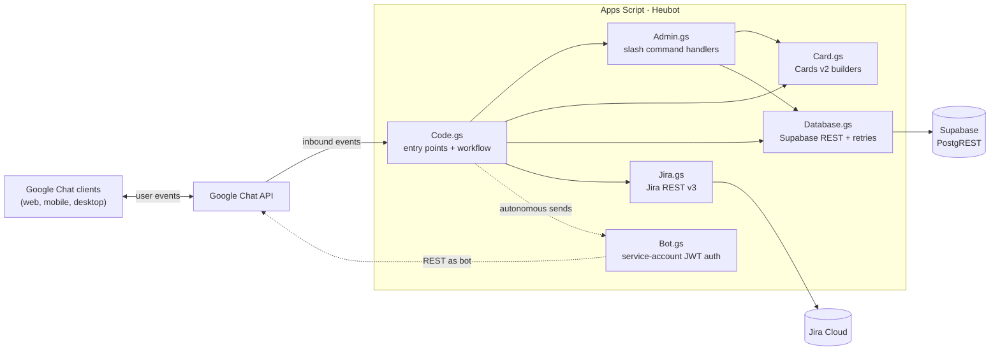

# Heubot — Google Chat Standup Bot

A Google Chat add-on that runs async daily standups for a Google Workspace team. Members get a private DM each afternoon prompting them to fill in their standup; the next morning a digest is posted to a shared team space.

Modeled on DailyBot/Geekbot, built free on Apps Script + Supabase.

---

## What it does

- **16:45 every workday** → bot DMs each active team member a small notification card with a "Fill Standup" button
- **Members fill the form** in their own DM (privately) — answers, optional Jira tickets pulled in automatically
- **17:15** → bot DMs a reminder to anyone who hasn't submitted yet
- **09:00 next workday** → bot posts a digest to the shared team space
  - Main message: a small summary card (response counts, names of responders and non-responders)
  - Each individual response is a thread reply under the summary
- **Friday submissions land in Monday's digest** (skips weekends)
- **Responses are editable** until the digest goes out (re-open the form, modify, re-submit)

---

## Architecture



**Two distinct paths into the Chat API:**

- **Solid lines** — request/response for inbound events. The bot receives a slash command or button click, runs a handler, and returns a card. Google Chat posts the response *as the bot* automatically because the framework owns the identity for these calls.
- **Dotted lines** — autonomous outbound sends (cron prompts, reminders, digests). These can't use the framework's identity because there's no event to attach to. Instead `Bot.gs` mints an OAuth token from a GCP service account and calls `chat.googleapis.com` directly. Without this path, time-triggered cron jobs would fail with `"Message cannot have cards for requests carrying human credentials"`.

---

## Tech stack

| Layer | Choice | Why |
|---|---|---|
| Runtime | Apps Script V8 | Free, hosted, integrates natively with Workspace |
| Backend | Supabase (PostgREST) | Free tier, no server to run, SQL access |
| Bot identity | GCP service account + JWT bearer flow | Required to send card-bearing messages autonomously |
| Local dev | `clasp` + `bun` | Edit locally in VS Code, push to Apps Script with one command |
| Source control | Git + GitHub | Standard |

---

## Prerequisites

Before starting setup, you need:

- A **Google Workspace** account (admin access to enable the Chat API)
- A **Google Cloud Console** account in the same org
- A **Supabase account** (free tier is plenty)
- A **Jira Cloud** account (optional, only if you want Jira ticket integration)
- **Node.js** or **Bun** installed locally
- **`clasp`** (Apps Script CLI, installed via npm/bun)
- A code editor (VS Code recommended)

---

## Setup

### Step 1 — Create the Google Cloud project

1. Go to [console.cloud.google.com](https://console.cloud.google.com)
2. Top-left project picker → **New Project**
3. Name it something memorable (e.g. `heubot`)
4. Make sure it's under your **Workspace organization**, not "No organization"
5. Click **Create**

### Step 2 — Enable required APIs

In your new GCP project:

1. **APIs & Services → Library**
2. Search for and enable each of:
   - **Google Chat API**
   - **Google Apps Script API**

### Step 3 — Configure the OAuth consent screen

1. **APIs & Services → OAuth consent screen**
2. **User type: Internal** (only people in your Workspace can authorize the bot)
3. Fill in:
   - App name: `Heubot`
   - User support email: your email
   - Developer contact: your email
4. **Save and continue** through the rest (no scopes or test users needed)

### Step 4 — Set up Supabase database

1. Go to [supabase.com](https://supabase.com) → New Project
2. Pick a name, database password, region
3. Wait for provisioning (~2 min)
4. Once ready, go to **SQL Editor** and run the schema from the [Database schema](#database-schema) section below
5. Go to **Project Settings → API** and copy:
   - **Project URL** (looks like `https://xxxxx.supabase.co`)
   - **`service_role` key** (NOT the `anon` key — we need elevated access for the bot)

### Step 5 — Create Jira API token (optional)

Skip this section if you don't want Jira integration.

1. Visit [id.atlassian.com/manage-profile/security/api-tokens](https://id.atlassian.com/manage-profile/security/api-tokens)
2. **Create API token** → name it `heubot`
3. Copy the token (you only see it once)
4. Note your Jira email and your Jira domain (e.g. `yourcompany.atlassian.net`)

### Step 6 — Create the Apps Script project

1. Go to [script.google.com](https://script.google.com)
2. **New project**
3. Rename it from "Untitled project" to `Heubot`
4. **Project Settings (gear icon, left sidebar)**:
   - Check **"Show 'appsscript.json' manifest file in editor"**
   - Note the **Script ID** at the top — you'll need it for clasp
5. Note the **Cloud Platform (GCP) Project number** field — click **Change project** and link it to the GCP project from Step 1

### Step 7 — Create the service account (bot identity)

The service account is the bot's own identity. Without it, the bot can only respond to direct interactions; it can't autonomously DM users or post to spaces (Google rejects card-bearing messages from human-credentialed callers).

1. GCP Console → **IAM & Admin → Service Accounts**
2. **+ Create Service Account**
3. Name: `heubot-bot`, ID auto-fills
4. Description: `Bot identity for Heubot Chat add-on`
5. **Create and Continue**
6. **Skip** the role assignment step (the bot identity is granted via the Chat API project membership, not via IAM roles)
7. **Done**
8. Click on the new `heubot-bot` service account → **Keys** tab → **Add Key → Create new key → JSON**
9. **A JSON file downloads** — save it somewhere safe (password manager, secure cloud storage). You'll paste its contents into Apps Script in the next step. **Never commit this file to git.**

### Step 8 — Add Script Properties (credentials storage)

In Apps Script editor → **Project Settings (gear icon) → Script Properties → + Add script property**.

Add each of these:

| Property | Value |
|---|---|
| `SUPABASE_URL` | `https://xxxxx.supabase.co` from Step 4 |
| `SUPABASE_KEY` | `service_role` key from Step 4 |
| `SERVICE_ACCOUNT_KEY` | Entire JSON contents of the file from Step 7 (paste as one big block) |
| `JIRA_EMAIL` | Your Jira account email (only if using Jira integration) |
| `JIRA_API_TOKEN` | The Jira API token from Step 5 (only if using Jira integration) |

### Step 9 — Set up local development with clasp + bun

This lets you edit code locally in VS Code instead of the web IDE.

1. **Install bun** (if you don't have it): `curl -fsSL https://bun.sh/install | bash`
2. **Clone this repo** (or copy the files into a local folder)
3. In the project folder: `bun install` (installs `@google/clasp` locally)
4. **Enable the Apps Script API for your account**: visit [script.google.com/home/usersettings](https://script.google.com/home/usersettings) → toggle **Google Apps Script API** to **On**
5. **Login**: `bunx clasp login` → opens a browser, sign in with the same Google account as the Apps Script project
6. **Create `.clasp.json`** in the project root with your script ID:
   ```json
   {"scriptId":"YOUR_SCRIPT_ID_HERE","rootDir":"."}
   ```
   This file is gitignored — never commit it.
7. **Verify connection**: `bun run status` — should list the `.gs` files that would be pushed
8. **First push**: `bun run push` — uploads all source files to Apps Script

The day-to-day workflow from here is: edit `.gs` files in VS Code → `bun run push` → test in Chat → `git commit`.

### Step 10 — Configure the Chat API

1. GCP Console → **APIs & Services → Google Chat API → Configuration**
2. Fill in:
   - **App name**: `Heubot`
   - **Avatar URL**: paste a URL to a logo image (you can use the [logo.png](logo.png) in this repo)
   - **Description**: `Daily standup bot`
   - **Functionality**: check both **Receive 1:1 messages** and **Join spaces and group conversations**
   - **Connection settings**: pick **Apps Script project** and paste your **Deployment ID** (you'll create one in Step 11 — you can come back to fill this in later)
   - **Visibility**: **Make this Chat app available to specific people and groups in [your domain]** for testing, or **all people in [your domain]** for full rollout
3. **Don't save yet** — slash commands are added in the same page (Step 12)

### Step 11 — Create an Apps Script deployment

1. Apps Script editor → top-right **Deploy → New deployment**
2. Click the **gear icon** → pick **Add-on** (or **Chat app**)
3. **Description**: `Initial deploy`
4. **Deploy**
5. Copy the **Deployment ID** that appears
6. Go back to **GCP Console → Chat API → Configuration → Connection settings** and paste the deployment ID

### Step 12 — Register slash commands

Still in **Chat API → Configuration**, scroll to **Slash commands** and add each of the following with **"Opens a dialog" UNCHECKED** for all of them:

| Command ID | Name | Description | Available in |
|---|---|---|---|
| `1` | `/settings` | Show current bot configuration | Both |
| `2` | `/set-schedule` | Update prompt/reminder/digest times | Both |
| `3` | `/questions` | Show standup questions | Both |
| `4` | `/add-question` | Add a new question | Both |
| `5` | `/team` | Show team members | Both |
| `6` | `/add-member` | Add a team member | Both |
| `7` | `/notify-all` | Notify all members to fill standup | Both |
| `8` | `/status` | Show today's standup status | Both |
| `9` | `/purge` | Delete responses by date range | Both |
| `10` | `/set-this-space` | Use this space for the daily digest | Both |
| `11` | `/standup` | Fill in your standup | Both |
| `12` | `/digest-now` | Manually post the digest | Both |

The **Command ID must match exactly** — they're hardcoded into the slash command router in [Admin.gs](Admin.gs).

**After adding all commands, click Save at the bottom of the entire Configuration page.** This is the #1 gotcha — the per-command popup has its own Save, but you also need to save the outer page or none of it persists.

### Step 13 — Authorize the script and grant scopes

1. Apps Script editor → open [Bot.gs](Bot.gs) → in the function dropdown pick `testBotAuth` → **Run**
2. The first run prompts for authorization. Accept all the requested scopes (Chat, external_request, scriptapp, etc.)
3. Check the **Executions** log — should print:
   ```
   Bot token minted (length: 1024)
   Found existing DM with users/<your-id>: spaces/<...>
   --- testBotAuth passed ---
   ```
4. If it fails, see [Troubleshooting](#troubleshooting)

### Step 14 — Seed the database

In Supabase SQL Editor, run:

```sql
-- Add yourself as the first admin
INSERT INTO admins (email) VALUES ('your.email@yourcompany.com');

-- Add yourself as a team member
INSERT INTO team_members (name, email, jira_username, active)
VALUES ('Your Name', 'your.email@yourcompany.com', '', true);

-- Default schedule (admins can change via /set-schedule)
INSERT INTO settings (key, value) VALUES
  ('PROMPT_TIME', '16:45'),
  ('REMINDER_TIME', '17:15'),
  ('DIGEST_TIME', '09:00'),
  ('TIMEZONE', 'Asia/Kathmandu'),
  ('STANDUP_SPACE_ID', 'spaces/REPLACE_ME'),
  ('JIRA_DOMAIN', 'yourcompany.atlassian.net'),
  ('JIRA_PROJECT', 'PROJ');

-- Default standup questions
INSERT INTO questions (sort_order, question, required) VALUES
  (1, 'What did you accomplish today?', true),
  (2, 'What will you work on tomorrow?', true),
  (3, 'Any blockers?', false);
```

Adjust the values to match your team.

### Step 15 — Install the test deployment in Chat

1. Apps Script editor → **Deploy → Test deployments** → **Install** (or Done if already installed)
2. Open Google Chat in a browser
3. Sidebar → **Apps** → search for "Heubot" → click → start a DM with the bot
4. Run `/settings` — you should see your settings card

### Step 16 — Set up the team space for digests

1. In Google Chat, click **+** next to "Spaces" → **Create space**
2. Name: `Standups` (or whatever fits)
3. Type: **Collaboration** (not Announcements — bots can't post to Announcements without manager privileges)
4. Access: **Private**
5. **Create**
6. In the new space, type `@Heubot` → **Add to space**
7. Run `/set-this-space` from inside the space → registers it as the digest destination

### Step 17 — Install time-based triggers

The bot needs cron triggers to run autonomously each day.

1. Apps Script editor → in the function dropdown pick `createTriggers` → **Run**
2. Authorize if prompted
3. Check **Triggers** (clock icon, left sidebar) — should show 4 triggers:
   - `sendStandupNotifications` daily at PROMPT_TIME (16:45)
   - `sendReminders` daily at REMINDER_TIME (17:15)
   - `postDigest` daily at DIGEST_TIME (09:00)
   - `checkDbUsage` monthly on day 1

If you get a "too many triggers" error, your service account has hit the rolling daily creation budget. Wait ~24 hours and try again.

### Step 18 — Onboard team members

For each person on your team:

1. Admin runs `/add-member` (or directly INSERTs into `team_members`)
2. The new member opens Heubot in their Chat sidebar (via Apps panel) and runs **any** slash command — e.g. `/standup`
3. That single interaction captures their `chat_user_id` to the database, which is required for the bot to autonomously DM them

After their first interaction, they'll start receiving the daily 16:45 notification automatically.

---

## Database schema

```sql
-- Settings (key/value)
CREATE TABLE settings (
  key TEXT PRIMARY KEY,
  value TEXT NOT NULL,
  updated_at TIMESTAMPTZ DEFAULT now()
);

-- Team members
CREATE TABLE team_members (
  id BIGSERIAL PRIMARY KEY,
  name TEXT NOT NULL,
  email TEXT NOT NULL UNIQUE,
  jira_username TEXT,
  chat_user_id TEXT,
  active BOOLEAN DEFAULT true,
  created_at TIMESTAMPTZ DEFAULT now()
);

-- Standup questions
CREATE TABLE questions (
  id BIGSERIAL PRIMARY KEY,
  sort_order INTEGER NOT NULL,
  question TEXT NOT NULL,
  required BOOLEAN DEFAULT true,
  created_at TIMESTAMPTZ DEFAULT now()
);

-- Standup responses
CREATE TABLE standup_responses (
  id BIGSERIAL PRIMARY KEY,
  date DATE NOT NULL,
  name TEXT NOT NULL,
  email TEXT NOT NULL,
  answers JSONB NOT NULL,
  jira_tickets JSONB,
  responded_at TIMESTAMPTZ DEFAULT now(),
  UNIQUE (date, email)
);

-- Admin emails
CREATE TABLE admins (
  email TEXT PRIMARY KEY,
  created_at TIMESTAMPTZ DEFAULT now()
);

-- Indexes
CREATE INDEX idx_responses_date ON standup_responses (date);
CREATE INDEX idx_responses_email ON standup_responses (email);
```

---

## File-by-file overview

| File | Purpose |
|---|---|
| [appsscript.json](appsscript.json) | Apps Script manifest — runtime, OAuth scopes, advanced services |
| [Code.gs](Code.gs) | Entry points (`onMessage`, `onCardClick`), date helpers, `sendStandupNotifications`, `sendReminders`, `postDigest`, `handleStandupSubmit`, `handleShowStandupForm`, trigger management |
| [Admin.gs](Admin.gs) | Slash command router and admin handlers (`/settings`, `/team`, `/notify-all`, `/digest-now`, `/standup`, etc.) |
| [Card.gs](Card.gs) | Cards v2 builders (`buildStandupCard`, `buildStandupNotificationCard`, `buildDigestSummaryCard`, `buildDigestReplyCard`, admin cards) |
| [Bot.gs](Bot.gs) | Service-account JWT bearer flow + Chat REST wrappers (`getBotAccessToken`, `botMessageCreate`, `botFindDirectMessage`, `botSetupDm`) |
| [Database.gs](Database.gs) | Supabase REST helpers with retry-with-backoff |
| [Jira.gs](Jira.gs) | Jira REST v3 ticket fetch via Basic Auth |

---

## Operating the bot

### Daily flow (autonomous)

| Time | Trigger | Function | Effect |
|---|---|---|---|
| 16:45 | Daily | `sendStandupNotifications` | DMs each active member a notification card |
| 17:15 | Daily | `sendReminders` | DMs members who haven't submitted yet |
| 09:00 next workday | Daily | `postDigest` | Posts threaded digest to the team space |
| Day 1 each month | Monthly | `checkDbUsage` | DMs admins if Supabase row count nears free-tier cap |

### Slash commands

**For all members:**
- `/standup` — open the standup form for the next workday meeting
- `/standup 2026-04-15` — open the form for a specific future date

**For admins only:**
- `/settings` — show current configuration
- `/set-schedule` — change prompt/reminder/digest times
- `/questions` — list and manage questions
- `/add-question` — add a question
- `/team` — list and manage team members
- `/add-member` — add a member
- `/notify-all` — manually fire the daily prompt
- `/digest-now [YYYY-MM-DD]` — manually post the digest
- `/set-this-space` — register the current space as the digest destination
- `/status` — show who's responded for the active meeting
- `/purge` — delete responses by date range

---

## Maintenance

### Updating credentials

If you need to rotate the Supabase or Jira keys, update the corresponding Script Property in Apps Script. No redeploy needed — the bot reads from `PropertiesService` on every call.

### Rotating the service account key

If the service account JSON key is compromised or you need to regenerate it:

1. GCP Console → **IAM & Admin → Service Accounts → heubot-bot → Keys**
2. **Add Key → Create new key → JSON** → save the file
3. Apps Script → **Project Settings → Script Properties** → update `SERVICE_ACCOUNT_KEY` with the new JSON contents
4. Back in GCP Console, **delete the old key** from the same Keys tab
5. Done — no code change, no redeploy. The next call to `getBotAccessToken()` reads the new key from Script Properties (the cache may serve the old token for up to 55 minutes; clear it manually if needed)

### Trigger management

- View all triggers: `dumpAllTriggers` (run from editor)
- Wipe all triggers: `deleteAllTriggersHard` (run from editor)
- Reinstall the standard set: `createTriggers` (run from editor; deletes the project's own triggers first by handler name, then recreates them from current settings)

### Adding a new slash command

1. Add the handler function in [Admin.gs](Admin.gs)
2. Add a `case` in `routeSlashCommand` with the next unused command ID
3. `bun run push` to upload
4. Register the command in **GCP Console → Chat API → Configuration → Slash commands** with the matching ID
5. Hard-refresh Chat (`Cmd+Shift+R`) — the new command appears in the autocomplete

---

## Troubleshooting

### "Heubot is unable to process your request" toast on a button click

The handler is throwing an exception or returning a malformed response. Check **Apps Script → Executions → most recent failure → expand log** for the actual error.

### Slash command not appearing in Chat autocomplete

- Did you click **Save at the bottom of the entire Chat API Configuration page**? The per-command popup save isn't enough.
- Hard-refresh Chat (`Cmd+Shift+R`).
- Wait ~60 seconds — slash command registration isn't instant.
- Verify the command shows in the Configuration page list with the correct Command ID.

### "Don't specify the calling user as a membership" error

This means the script ran as a human user and tried to DM that same user. The bot must use service-account auth via [Bot.gs](Bot.gs); make sure no `Chat.Spaces.*` calls remain (use `botMessageCreate` / `botFindDirectMessage` / `botSetupDm`).

### "Message cannot have cards for requests carrying human credentials"

Same root cause as above. Service-account auth required.

### "Service account authentication doesn't support access to user information using email aliases"

You're calling a Chat API method with an email-style user ID like `users/foo@bar.com`. Service-account-authenticated calls require numeric user IDs (e.g. `users/117260094786438825675`). Capture them via `captureChatUserId` and store in `team_members.chat_user_id`.

### "This add-on has created too many time-based triggers"

You've hit the rolling daily trigger-creation budget. Each `createTriggers` run spends 4 from the budget; the budget is ~20/day per user per add-on and refills over 24 hours. Wait a day and try again. Don't spam saves to `/set-schedule` — it tries to recreate triggers each time.

### Bot DM'd a member but the member can't see it

Likely the member is in `team_members` but their `chat_user_id` is null (they haven't interacted with the bot yet). The member needs to run any slash command once (e.g. `/standup`) to capture their user ID. After that, future notifications work.

### `/digest-now` shows "No Standup Space"

`STANDUP_SPACE_ID` is still `spaces/REPLACE_ME`. Run `/set-this-space` from inside the team space you want to use.

### Service account smoke test (`testBotAuth`) fails with `invalid_grant`

Usually a clock skew issue (>5 minutes drift between your machine and Google's servers) or a malformed private key. Re-download the JSON key, paste fresh into `SERVICE_ACCOUNT_KEY`. If still failing, regenerate the key entirely.

---

## License

Internal tool. No license, not for distribution.
